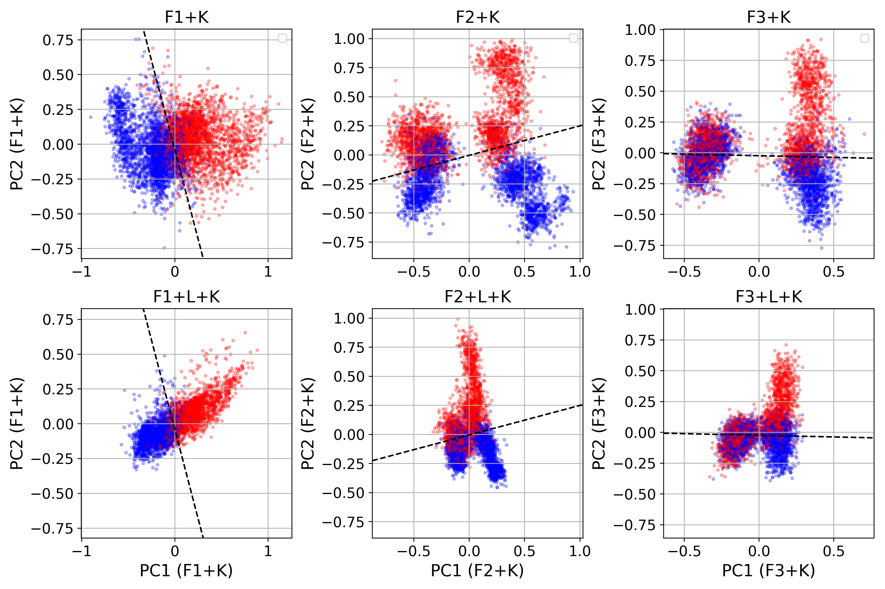

# Exploring the generalization of LLM truth directions on conversational formats:

This is a code repository corresponding to this paper: https://arxiv.org/abs/2505.09807 

## Setup: 

Clone the repo:

`git clone git@github.com:TimourIc/llm-liedetector-keyphrase.git`

Make virtual environment and install requirements:

`python -m venv venv` (and activate)

`pip install -r requirements.txt`

## Reproducing all results:

Raw true/false statement datasets were reused from https://github.com/sciai-lab/Truth_is_Universal, and are stored in:

`data/raw/ `

To generate all the conversational data formats run:

`python get_data.py`

To generate all the activations run on setup that is capable of loading 8 billion LLMs (needed $\approx$ 8h on A100 on Google Colab):

`python get_acts.py`

To generate the figures of the generalization accuracy presented in the paper run (change model and probe names yourself):

`notebooks/compute_accuracies.ipynb`

To generate the figures of the PCA visualization run:

`notebooks/visualize_PCA.ipynb`

# References:

Disclaimer: This repository reuses/adapts some parts of code from https://github.com/sciai-lab/Truth_is_Universal by Scientific AI (2024), that was used for the 2024 paper https://arxiv.org/abs/2407.12831. We are grateful to the authors for open sourcing all of their code and data.
